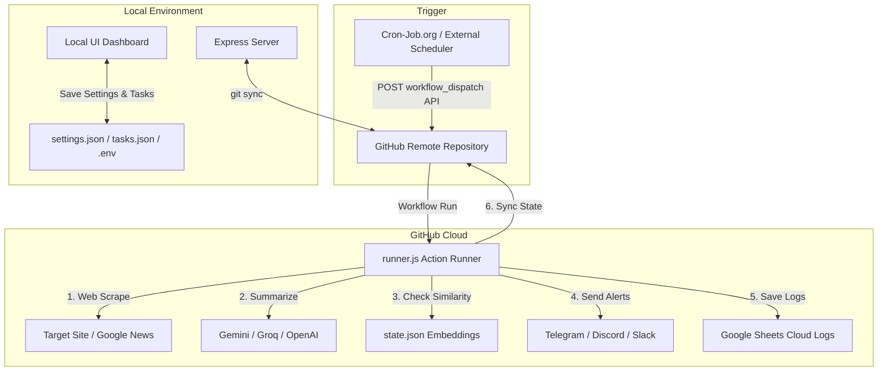

# AuraVigil
### Monitor the web, summarize updates with AI, and get alerted on Telegram, Discord, or Slack.

AuraVigil is a free, self-hosted tool that keeps an eye on the web for you. It scrapes webpages or monitors Google News feeds, summarizes key updates using AI models (like Gemini, OpenAI, Groq, or Cerebras), and sends instant notifications to your chat channels.

To save you from notification fatigue, it uses **smart semantic deduplication**—so you won't get spammed if the webpage updates but the actual news is the same.

It comes with a clean, local web dashboard to manage your tasks, and runs completely free in the cloud using GitHub Actions.

---

## How it Works

Here is a quick look at how the local dashboard, GitHub repository, and cloud runner talk to each other:



---

## Key Features

* **Simple Local Dashboard:** Configure monitor tasks, check connection credentials, adjust AI settings, and view history from a friendly web UI (React/Vite).
* **Smart Deduplication:** Uses AI embeddings and Cosine Similarity to compare new text against the last sent alert. If the content is contextually identical (even if the wording shifted slightly), it skips sending it.
* **Choose Your AI:** Works out of the box with Gemini (default), Groq, Cerebras, OpenAI, or any custom OpenAI-compatible API endpoint (like a local Ollama server).
* **Auto-Scraping & News Fallback:** Automatically downloads page text, strips away layout clutter (script, style, navigation links), and feeds it to the AI. If you don't provide a URL, it automatically searches Google News RSS for your task topic.
* **On-Time Cloud Scheduling:** Avoids the standard delays of GitHub Actions' native scheduler by using a free external trigger (like Cron-Job.org) to launch runs instantly.
* **Google Sheets Cloud Logs:** Writes execution history, skipped runs, and errors directly to a Google Sheet. This offloads logs from your Git history to keep your repository clean.
* **Zero Hosting Costs:** Runs entirely free in the cloud on GitHub's serverless infrastructure.

---

## Setup & Deep Dives

To get up and running, follow our step-by-step guides:

1. **[docs/SETUP.md (Detailed Setup Guide)](file:///C:/Users/anilg/.gemini/antigravity/scratch/telegram-cron-alerts/docs/setup.md)**
   - Creating Telegram bots and finding your Chat ID.
   - Setting up webhooks for Slack and Discord.
   - Connecting Google Sheets logging with a Service Account.
   - Deploying to GitHub Actions and setting up precision scheduling.
2. **[docs/FEATURES.md (How it Works Under the Hood)](file:///C:/Users/anilg/.gemini/antigravity/scratch/telegram-cron-alerts/docs/features.md)**
   - How the web scraper extracts text content.
   - How the semantic similarity algorithm prevents duplicate spam.
   - How the Git auto-sync engine operates without merge conflicts.

---

## Configuration Reference (`.env`)

AuraVigil saves your credentials locally in a `.env` file (and you will add these to your GitHub Repository Secrets for the cloud runner). Here are the supported options:

```properties
# Notification Channels
TELEGRAM_BOT_TOKEN=123456789:ABCdefGh...
TELEGRAM_CHAT_ID=-100123456789
DISCORD_WEBHOOK_URL=https://discord.com/api/webhooks/...   # Optional
SLACK_WEBHOOK_URL=https://hooks.slack.com/services/...     # Optional

# AI Model Credentials
GEMINI_API_KEY=AIzaSy...         # Accepts Gemini, Groq (gsk_...), or Cerebras (cbs-...) keys

# Custom LLM Settings (Optional)
CUSTOM_API_ENDPOINT=https://api.yourprovider.com/v1
CUSTOM_AI_MODEL=gpt-4o-mini

# Google Sheets Logging (Optional)
GOOGLE_SHEET_ID=1a2b3c4d5e...
GOOGLE_SERVICE_ACCOUNT_KEY=eyJhY2NvdW50...   # Base64 encoded Service Account JSON Key
```

---

## Things to Keep in Mind (Limitations)

* **GitHub's Native Cron is Delayed:** If you try to schedule the run using GitHub's native cron trigger, it can be delayed by 15 to 45 minutes because free scheduled runs are low priority. *Note: Using our recommended Cron-Job.org setup bypasses this queue and runs instantly.*
* **Native 5-Minute Resolution Limit:** GitHub's native scheduler doesn't allow runs more frequent than every 5 minutes. *Note: You can configure Cron-Job.org to trigger as frequently as you want.*
* **Static HTML Scraping:** The built-in web scraper only downloads raw, static HTML. It cannot run JavaScript. If a target site is a Single Page Application (React/Vue/Angular) that loads content dynamically via JS, the scraper will only see an empty shell.
* **Google Sheets API Limits:** Google Sheets limits API requests to 60 per minute per project. This is plenty for AuraVigil, but if you run dozens of tasks concurrently every minute, you might hit rate limits.
* **State Sync Push Race:** AuraVigil updates `state.json` inside Git. If you save changes on your local dashboard at the exact second the cloud runner completes a run and pushes back, a minor sync race can occur. The system handles this using `git pull --rebase`, but it's best to avoid rapid settings changes while the cloud runner is executing.

---

## Local Commands

Run these commands in your project directory:

```bash
# Install packages
npm install

# Start local server and dashboard concurrently
npm run dev

# Run only the local Express API server
npm run server

# Run only the Vite React UI client
npm run client

# Run the task checker manually right now
node runner.js
```
