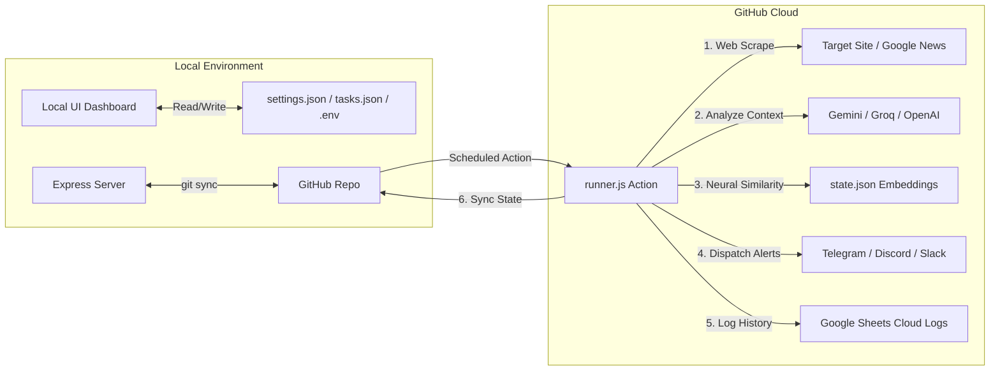

# 🛡️ AuraVigil
### Automated AI-Powered Scraper & Multi-Channel Alert Engine

AuraVigil is a zero-cost, self-hosted, serverless-capable alerting agent. It scrapes webpages, monitors RSS feeds, analyzes updates using state-of-the-art AI models (Gemini, OpenAI, Groq, Cerebras, etc.), performs neural semantic deduplication to avoid repetitive noise, and delivers immediate alerts directly to Telegram, Discord, or Slack.

It features a sleek React/Vite-based **local configuration dashboard** and runs fully serverless in the cloud using **GitHub Actions**.

---

## 🗺️ System Architecture



---

## ✨ Key Features

* 💻 **Premium Local Dashboard:** Manage tasks, schedule intervals, check connections, configure providers, and view history from a modern React/Vite UI.
* 🧠 **Neural Semantic Deduplication:** Uses vector embeddings (Gemini/OpenAI/Cerebras) and Cosine Similarity to compare new alert content against previous ones. If a new alert is wording-wise different but contextually identical, it is filtered out to prevent spamming your chats.
* 🤖 **Broad AI Model Integration:** Native support for Google Gemini, Groq, Cerebras, OpenAI, and any custom OpenAI-compatible API endpoint (e.g., Local Ollama/LM Studio).
* 🌐 **Automatic Web Scraping & RSS feeds:** Automatically fetches page text, strips design clutter (script/style/nav tags), and feeds it to the AI. If no URL is provided, it automatically searches Google News RSS for your task topic.
* 📊 **Google Sheets Cloud Integration:** Execution history, skipped runs, and errors are written directly to Google Sheets using a secure, zero-dependency JWT service account assertion, keeping Git commit histories completely clean.
* ⚡ **Zero Infrastructure Cost:** Runs completely free in the cloud utilizing GitHub Actions' serverless task runner.

---

## 📖 Table of Contents & Quick Links

To get up and running, please read our dedicated documentation guides:

1. **[docs/SETUP.md (Detailed Setup Guide)](file:///C:/Users/anilg/.gemini/antigravity/scratch/telegram-cron-alerts/docs/setup.md)**
   - Complete step-by-step credentials walkthrough (Telegram, Discord, Slack).
   - Google Service Account setup & Google Sheets integration.
   - GitHub Secrets config & workflow write permission settings.
2. **[docs/FEATURES.md (Features & Internals Deep Dive)](file:///C:/Users/anilg/.gemini/antigravity/scratch/telegram-cron-alerts/docs/features.md)**
   - How the content scraper parses target HTML documents.
   - Inside the Cosine Similarity and local character frequency fallback algorithms.
   - The mechanics of git-rebase auto-synchronization.

---

## ⚙️ Configuration Reference (`.env`)

AuraVigil uses a local `.env` file (or GitHub Action Secrets) for sensitive keys. Here are the supported configuration options:

```properties
# Primary Notification Credentials
TELEGRAM_BOT_TOKEN=123456789:ABCdefGh...
TELEGRAM_CHAT_ID=-100123456789

# Alternative Webhook Channels (Optional)
DISCORD_WEBHOOK_URL=https://discord.com/api/webhooks/...
SLACK_WEBHOOK_URL=https://hooks.slack.com/services/...

# AI Model Provider Credentials
GEMINI_API_KEY=AIzaSy...         # Can also accept Groq (gsk_...) or Cerebras (cbs-...) keys

# Custom LLM Server Configurations (Optional)
CUSTOM_API_ENDPOINT=https://api.yourprovider.com/v1
CUSTOM_AI_MODEL=gpt-4o-mini

# Google Sheets Cloud Logger Credentials (Optional)
GOOGLE_SHEET_ID=1a2b3c4d5e...
GOOGLE_SERVICE_ACCOUNT_KEY=eyJhY2NvdW50...   # Base64 encoded Service Account JSON Key
```

---

## ⚠️ Known Limitations

Before setting up AuraVigil in production, make sure you are aware of the following design limitations:

1. **GitHub Actions Schedule Delays:**
   GitHub Actions workflow schedules (cron triggers) are executed as best-effort tasks on shared runners. The workflow scheduler is guaranteed to run, but is frequently delayed by **5 to 15 minutes** behind the target schedule depending on GitHub's active queue size.
2. **Minimum 5-Minute Resolution:**
   The repository serverless workflow is configured to run every 5 minutes (`*/5 * * * *`). You cannot configure a task schedule that executes more frequently than once every 5 minutes.
3. **Static Page Scraping Only:**
   The zero-dependency content scraper retrieves raw HTML documents. It **cannot execute client-side JavaScript**. Single Page Applications (SPAs) built entirely with client-rendered frameworks (React/Vue/Angular) will return empty structures or skeleton frames instead of loaded text.
4. **Google Sheets API Rate Limits:**
   The Google Sheets API has a default limit of **60 requests per minute per user**. While plenty for AuraVigil's default cron cadence, running dozens of tasks simultaneously at a high frequency might trigger transient API rate limit errors (Status 429).
5. **Deduplication State Collision:**
   AuraVigil pushes `state.json` updates back to Git. If the scheduler runner executes in the cloud at the exact same moment you save changes on your local UI dashboard, a minor push race condition can occur. The git engine handles this via `git pull --rebase`, but high frequency UI edits could delay a synchronization push.

---

## 🛠️ Local Command Reference

To manage or test your local project, use the following package commands:

```bash
# Install dependencies
npm install

# Start both backend and frontend dashboard concurrently
npm run dev

# Start only the local backend API server
npm run server

# Start only the Vite React UI client
npm run client

# Manually execute the task runner locally
node runner.js
```
