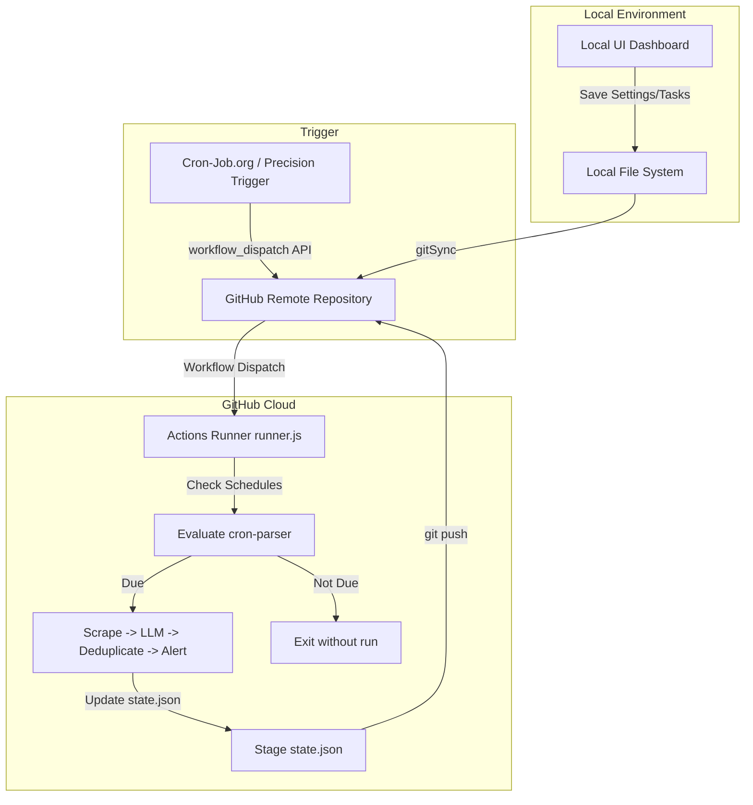

# AuraVigil Features & Internal Mechanisms

If you're curious about what happens behind the scenes, this guide breaks down how AuraVigil handles scraping, filters duplicates with AI, and synchronizes files without a database.

---

## 1. Web Scraping & Context Extraction

AuraVigil tasks can extract live content from the web before analyzing it with an AI model.

### Automatic Scraper
When a task has a target URL configured (like `https://news.ycombinator.com`), the runner runs our zero-dependency web scraper ([lib/scraper.js](file:///C:/Users/anilg/.gemini/antigravity/scratch/telegram-cron-alerts/lib/scraper.js)):
1. Downloads the raw HTML from the target page.
2. Strips out script and style tags (`<script>`, `<style>`, `<svg>`, `<nav>`, `<footer>`) to avoid wasting LLM token limits on code design.
3. Cleans up the remaining tags to compile a clean text string of raw page content.
4. Passes the text to the AI model alongside your prompt:
   ```text
   Context from webpage (https://example.com):
   ---
   [Scraped Page Content Here...]
   ---
   User Request: [Your prompt from task.json]
   ```

### Google News RSS Fallback
If you configure an AI monitor but **do not provide a URL**, AuraVigil doesn't crash. Instead, it creates a search query on Google News using your task name:
* **Task Name:** `Tesla Stock News`
* **Auto-generated URL:** `https://news.google.com/rss/search?q=Tesla+Stock+News&hl=en-US&gl=US&ceid=US:en`
* It scrapes the headlines list from the XML feed and sends them to the model as context.

### Built-in Search (Groq/Compound Bypass)
If you select the **Groq provider** and use the default model `groq/compound`, AuraVigil skips local scraping. This model has its own built-in web search tool, so it queries the web directly for your prompt.

---

## 2. Neural Semantic Deduplication

To save you from getting spammed with identical notifications (for example, warning you 20 times that a stock price remains low), AuraVigil filters out duplicate alerts before delivery.

### How it works:
1. **Embedding Generation:** When the AI generates a new alert message, AuraVigil asks the selected AI provider to create a text embedding (a 1536-dimensional vector representing the semantic meaning of the message).
2. **Cosine Similarity Check:**
   It calculates the similarity between the new vector (\(A\)) and the previous alert's vector (\(B\)) stored in `state.json`:
   \[
   \text{Similarity} = \frac{A \cdot B}{\|A\| \|B\|}
   \]
3. **Threshold Check:** If the similarity score is greater than or equal to your task's threshold (defaults to `0.90` or `90%`), the alert is **skipped**.
4. **State Update:** The task's last run time is updated, but the text and embedding vector remain unchanged. Subsequent runs will still be compared to the original alert until a new, unique alert breaks through.

### Local Fallback Similarity:
If you aren't using an AI embedding model, or the network API call fails, the system switches to a **character frequency overlap similarity algorithm** ([lib/ai.js](file:///C:/Users/anilg/.gemini/antigravity/scratch/telegram-cron-alerts/lib/ai.js)):
* It counts individual character frequency signatures of both strings and calculates the cosine distance between those frequency maps.
* While less accurate than neural embeddings, it prevents exact or near-exact text duplicates.

---

## 3. Scheduling & Git Synchronization Engine

To avoid the cost and complexity of hosting an active database online, AuraVigil uses your Git repository as its database.



### Auto-Sync (UI to Git)
When you save a task or edit credentials on the dashboard, the local server handles git commands automatically ([lib/git.js](file:///C:/Users/anilg/.gemini/antigravity/scratch/telegram-cron-alerts/lib/git.js)):
1. Stages config files: `tasks.json`, `settings.json`, and `state.json`.
2. Commits changes with a local action message.
3. Pulls latest changes from GitHub using a safe rebase (`git pull --rebase`).
4. Pushes the new commit to your remote repo.

### Cloud Runner State Persistence
When the cloud runner finishes executing tasks, it saves the new embedding vectors and alerts to `state.json`. 
* **If the state updated:** It commits and pushes `state.json` back to your repo.
* **If nothing updated:** It skips committing to avoid polluting your Git history.
* All cloud commits include `[skip ci]` in the message to prevent triggering infinite loop runs.

---

## 4. Google Sheets Logging Integration

Instead of committing verbose logs back to the Git repository, AuraVigil writes log reports to Google Sheets.

* **OAuth2 Authentication:** Uses Node's built-in `crypto` module to sign a JSON Web Token (JWT) assertion. It requests a temporary bearer access token from `https://oauth2.googleapis.com/token`.
* **Zero Dependencies:** Requires no heavy libraries (`google-auth-library` or `googleapis` packages are not used), keeping the repository lightweight and fast.
* **Table Initialization:** If the sheet is empty, the connector automatically initializes column headers:
  `['Timestamp', 'Task ID', 'Task Name', 'Schedule', 'Status', 'Message Preview / Details', 'AI Model']`
* **Error Logging:** Both successful runs, skipped tasks (due to deduplication), and execution errors are written to the sheet in real-time.
