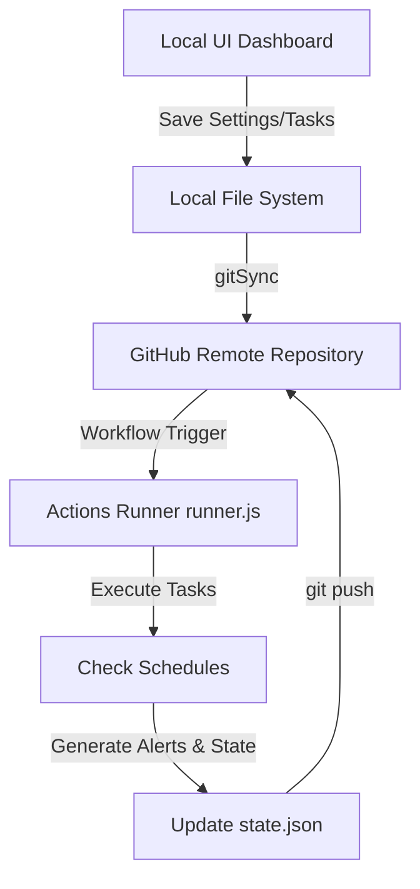

# AuraVigil Features & Internal Mechanisms

This document explains the core features of AuraVigil and how they work under the hood.

---

## 1. Web Scraping & Context Extraction

AuraVigil tasks can extract live content from the web before processing it with an AI model.

### Automatic Content Scraper
When a task has a target URL configured (e.g., `https://news.ycombinator.com`), the runner executes a zero-dependency scraper ([lib/scraper.js](file:///C:/Users/anilg/.gemini/antigravity/scratch/telegram-cron-alerts/lib/scraper.js)):
1. Performs a fetch request to download the raw HTML.
2. Removes non-content tags: `<script>`, `<style>`, `<svg>`, `<nav>`, and `<footer>`.
3. Strips remaining HTML tag syntax to compile clean text.
4. Passes this text to the AI model as context:
   ```text
   Context from webpage (https://example.com):
   ---
   [Scraped Page Content Here...]
   ---
   User Request: [Your prompt from task.json]
   ```

### Google News RSS Fallback
If you create an AI task but **do not specify a URL**, AuraVigil automatically generates a Google News RSS search query based on the task name:
* **Task Name:** `Tesla Stock News`
* **Auto-generated URL:** `https://news.google.com/rss/search?q=Tesla+Stock+News&hl=en-US&gl=US&ceid=US:en`
* It scrapes the resulting XML feeds of news headlines and uses them as context.

### Built-in Search Bypass (Groq/Compound)
If the **Groq provider** is selected with its default compound model (`groq/compound`), AuraVigil skips the local scraper. The compound model has a native, built-in search tool that queries the web directly for the task name/prompt.

---

## 2. Neural Semantic Deduplication

To prevent sending repeat notifications for the same news (e.g., sending the same warning 20 times because a price remains low), AuraVigil employs semantic deduplication.

### How It Works:
1. **Embedding Generation:** After the AI model generates a new alert message, AuraVigil requests a text embedding (a 1536-dimensional numerical vector representing the meaning of the text) using the selected provider's embedding model.
2. **Cosine Similarity Check:**
   It calculates the similarity between the new vector (\(A\)) and the previous alert's vector (\(B\)) stored in `state.json`:
   \[
   \text{Similarity} = \frac{A \cdot B}{\|A\| \|B\|}
   \]
3. **Threshold Check:** If the similarity score is greater than or equal to the task's configured threshold (default `0.90` or `90%`), the alert is **skipped** as duplicate.
4. **State Persistence:** The task's `state.json` entry is updated with the last run timestamp, but the text and embedding vector remain unchanged so subsequent runs are still compared to the original alert.

### Local Fallback Similarity:
If no embedding model key is available (or the network API call fails), the system falls back to a **character frequency overlap similarity algorithm** ([lib/ai.js](file:///C:/Users/anilg/.gemini/antigravity/scratch/telegram-cron-alerts/lib/ai.js)):
* It counts individual character frequency signatures of both strings and calculates the cosine distance between those frequency maps.
* While less accurate than neural embeddings, it prevents exact or near-exact text duplicates.

---

## 3. Git Synchronization Engine

To avoid keeping a database online, AuraVigil uses your Git repository as its persistent state database.



### Auto-Sync (UI to Git)
When you save a new task or change settings on the UI, the backend server automatically runs Git commands ([lib/git.js](file:///C:/Users/anilg/.gemini/antigravity/scratch/telegram-cron-alerts/lib/git.js)):
1. Stages config files: `tasks.json`, `settings.json`, and `state.json`.
2. Commits changes with a local action message.
3. Performs a `git pull --rebase` to merge any updates from the cloud.
4. Pushes the new commit to your GitHub remote.

### State Persistence (Actions to Git)
When the cloud runner finishes execution, it updates `state.json` with the new alert text and vector embeddings. It then stages `state.json` and runs a check:
* **If state changed:** It commits and pushes the updated `state.json` back to your repo.
* **If no state changed:** It skips the commit to prevent polluting your repository history.
* All commits from Actions include `[skip ci]` in the commit message to prevent triggering infinite build loops.

---

## 4. Google Sheets Logging Integration

Instead of committing verbose logs back to the Git repository, AuraVigil writes log reports to Google Sheets.

* **OAuth2 Authentication:** Uses Node's built-in `crypto` module to sign a JSON Web Token (JWT) assertion. It requests a temporary bearer access token from `https://oauth2.googleapis.com/token`.
* **Zero Dependencies:** Requires no heavy libraries (`google-auth-library` or `googleapis` packages are not used), keeping the repository lightweight and fast.
* **Table Initialization:** If the sheet is empty, the connector automatically initializes column headers:
  `['Timestamp', 'Task ID', 'Task Name', 'Schedule', 'Status', 'Message Preview / Details', 'AI Model']`
* **Error Logging:** Both successful runs, skipped tasks (due to deduplication), and execution errors are written to the sheet in real-time.
